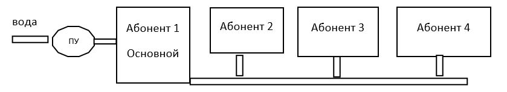

ВОДНАС-А001

***ЗАДАЧА:*** Необходим иметь возможность производить расчет по субабонентам, которые подключены к вводу основного абонента.

**ДЛЯ КОГО:** Абонентский отдел по работе с населением

***КОНТЕКСТ*:** В частном секторе есть схема подключения абонентов, когда на несколько домовладений подаётся вода, через ввод который идёт от другого абонента и таким образом получает последовательная цепочка подключений.

Первый абонент является основным абонентом и у него установлен прибор учета (ПУ), остальные абоненты считаются субабонентами. При передаче показаний по ПУ весь объем начисляется на основного абонента (Абонент1). Все начисленные объемы субабонентам, которые они потребили индивидуально, «снимаются» с основного абонента в момент начисления субабонентам, т.е. в момент или передачи показаний своих приборов учета или начисления по нормативам в случае отсутствии показаний приборов учета.

Если в течении месяца по основному прибору учета не поступают показания, то показания рассчитываются исходя из среднего потребления прибора учёта.

**РЕАЛИЗАЦИЯ: **

1.  Для определения основного абонента и субабонентов добавить новый способ распределения общего прибора учета «Субабоненты последовательное подключение». В документе «Схема распределения общего прибора учета» необходимо указать прибор учета и основного абонента, всех остальных абонентов (субабоннтов) и способ распределения «Субабоненты».

2.  В алгоритмы начисления внести изменения, которые сторнируют объем и суммы субабонентов с основного абонента, а именно:

    1.  В алгоритм записей начисления необходимо проверить наличие начислений по абонентам, которые являются субабонентами.

    2.  Сформировать дополнительные сторнирующие начисления по основному абоненту и прибору учета с признаком «Перерасчет»

**ПРИМЕРЫ:**

Есть схема подключения субонентов. Основной абонента передаёт показания в объема 10 м3, а два субабонента в объеме 2 м3 по прибору и по нормативу 7 м3. Цена за 1 м3 50 руб. У абонентов нет долгов

| Операция                                                 | Начисленный объем                           | Долг Абонент 1      | Долг Абонент 2 | Долг абонента 3 |
|----------------------------------------------------------|---------------------------------------------|---------------------|----------------|-----------------|
| Абонент 1 (основной абонент) передаёт 10 м3 по общему ПУ | 10 м3                                       | 500 руб.            | 0 руб.         | 0 руб.          |
| Абонент 2 (субабонент) передаёт 2 м3 по своему ПУ        | 2 м3 абоненту 2 - 2 м3 с основного абонента | 500 -100 = 400 руб. | 100 руб.       |                 |
| Абонент 3 (субабонент) начислено по норме 7 м3           | 7 м3 абоненту3 - 7 м3 с основного абонента  | 400 – 350 = 50 руб. |                | 50 руб.         |

**СВЯЗАННЫЕ ЗАДАЧИ:** создать отчет или вариант отчета по начислениям, который бы выводил начисления и абонентов по общему прибору учета
